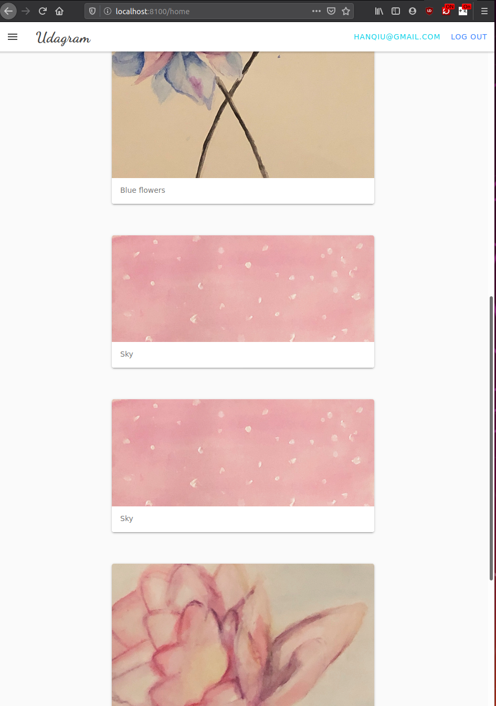
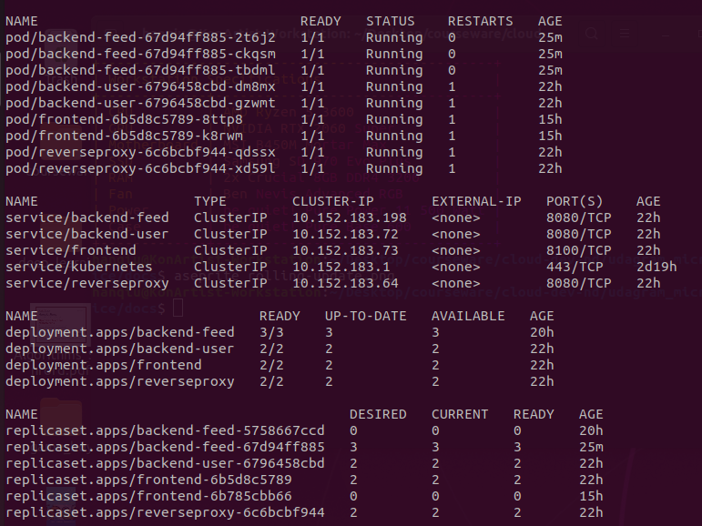
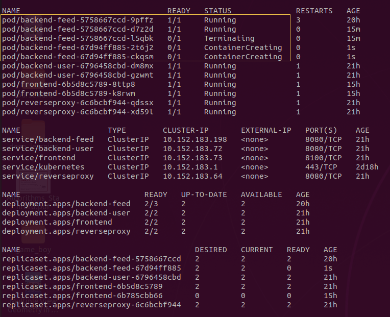
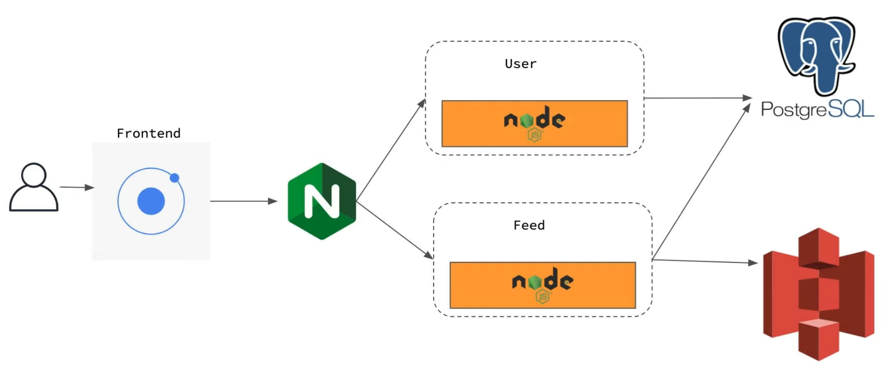
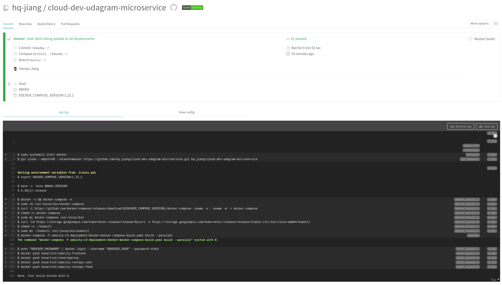

# Refactor Udagram app into Microservices and Deploy

This projects demonstrates the usage of microservices in contrast to a monolith application.
It shows a feed of images from an AWS S3 bucket and registrated Users are able to post images.

It supports running locally with docker compose and can be deployed to a Kubernetes cluster.
The code is build and deployed with Travis CI.

This project is part of the Udacity Cloud Developer nanodegree. The starter code is taken from
https://github.com/udacity/nd9990-c3-microservices-v1.git.

This is what the application looks like:  


## Contents
- [Dependencies](#dependencies)
- [Usage](#usage)
- [Overview](#overwiew)
- [Continuous Integration](#continuous-integration)


## Dependencies
### Run locally with docker compose:
- Ionic
- npm
- Docker
- Kubernetes
- AWS credentials set up

### Run on cluster
- kubectl
- KubeOne
- terraform

### Dockerhub images
- konartist/udacity-restapi-user
- konartist/reverseproxy
- konartist/udacity-frontend
- konartist/udacity-restapi-feed


### Other Resources
- AWS RDS
- AWS S3

## Usage

### Run locally
You can use my dockerhub images to run the application without building.
```
cd udacity-c3-deployment/docker
docker-compose up
```
The app should be available at http://localhost:8100

### Build the containers
To build the containers run the following:
```
cd udacity-c3-deployment/docker
docker-compose -f docker-compose-build.yaml build --parallel
```
To run these containers, the images `docker-compose.yaml` must be changed.

### Deploy on cluster

#### 1. Provision resources
To deploy the application to a cluster, you first need to provision the required infrastructure and
install Kubernetes. This can be done with KubeOne in combination with terraform. Instructions can be
found here: https://github.com/kubermatic/kubeone/blob/master/docs/quickstart-aws.md.
Additionally, kubectl must be installed to interface with the Kubernetes cluster.

#### 2. Config setup
Then the following files must be created adapted. The contain information about the AWS S3 and AWS
RDS resources and all the secrets. Be careful not to commit these secrets:
- udacity-c3-deployment/k8s/env-config.yaml needs to be adapted
```
apiVersion: v1
kind: ConfigMap
data:
  AWS_BUCKET: xxxxxxxxxxxxxxxxx
  AWS_PROFILE: xxxxxxxxxxxxxxxx
  AWS_REGION: xxxxxxxxxxxxxxxxx
  JWT_SECRET: xxxxxxxxxxxxxxxxx
  POSTGRESS_DB: xxxxxxxxxxxxxxx
  POSTGRESS_HOST: xxxxxxxxxxxxx
  URL: xxxxxxxxxxxxxxxxxxxxxxxx
metadata:
  name: env-config
```
- udacity-c3-deployment/k8s/aws-secret.yaml:
```
apiVersion: v1
kind: Secret
metadata:
  name: aws-secret
type: Opaque
data:
  credentials: xxx<AWS config credential file, found under ~/.aws>xxx
```
- udacity-c3-deployment/k8s/env-secret.yaml:
```
apiVersion: v1
kind: Secret
metadata:
  name: env-secret
type: Opaque
data:
  POSTGRESS_USERNAME: xxxxxxxxxxxxxxxx
  POSTGRESS_PASSWORD: xxxxxxxxxxxxxxxx
```

__Note__: All secrets must be base64 encoded. This can be done with
```
echo -n 'SECRET' | base64
```

#### 3. Deploy
Once everything is set up, run the following command to deploy everything:
```
kubectl apply -f udacity-c3-deployment/k8s
```
You should then see the following output with `kubectl get all` :  


#### 4. Rolling update
When images are changed and redeployed, a rolling update is performed:  



#### 5. Port Forwarding
In order to view the services locally, one must port forward the localhost to the
frontend and the reverseproxy.
```
kubectl port-forward service/reverseproxy 8080:8080
mkubectl port-forward service/frontend 8100:8100
```
After that the app is available under https://localhost:8100

## Overview

This application consists of four services:
- frontend
- restapi-user
- restapi-feed
- reverseproxy



### Frontend
The frontend is build with Ionic and serves the UI of the application. It shows and image feed
and allows users to register and login.

### Restapi-User
The restapi-user takes care of the user registration and login. It authenticates the
user with JSON Web Tokens. Usernames and the salted hashes of the user passwords are stored on a
AWS RDS Postgres database. The restapi-user is synchronizing with this database.

### Restapi-Feed
The restapi-feed fetches all images files listed in the AWS RDS Postgres database from the AWS S3.
User can also upload images, once authenticated, with a PUT request.

### Reverseproxy
The reverseproxy is a nginx service that routes all the requests to the correct microservice.
This is especially needed, when microservices listen to the same ports.


## Continuous Integration
The repository builds and deploys everything to DockerHub on every commit on the master.

